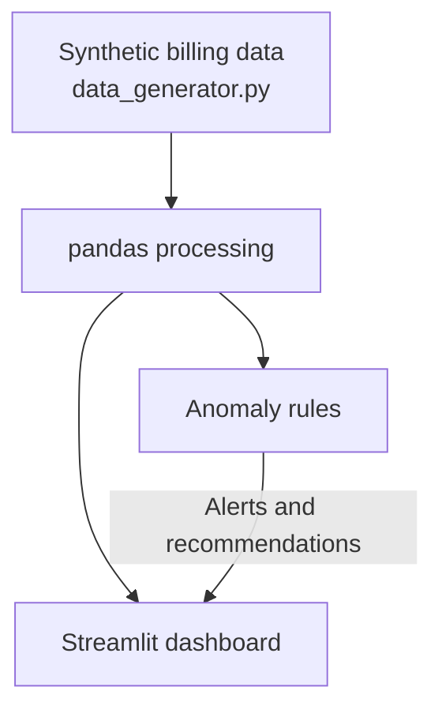

# FinOps Cloud Cost & Anomalies Dashboard

An interactive dashboard to monitor multi-cloud spend (AWS and Azure) and flag unusual cost patterns before they turn into budget surprises.

Built with Python, pandas, Plotly and Streamlit. All data is **synthetic**, generated by `data_generator.py`.

## The problem

Cloud costs rarely explode overnight. They drift: a test environment left running over a weekend, a service scaled up and never scaled down. By the time the monthly invoice arrives, the money is already spent.

IT leaders need a simple view that answers three questions quickly:

- How much are we spending, and where?
- Is this week different from last week?
- Is anything clearly out of line?

## What it does

- **Consolidated view** of daily spend across AWS and Azure.
- **Filters** by cloud provider, environment (Production, Staging, Development) and department.
- **Weekly KPI**: spend in the last 7 days vs the previous 7 days.
- **Breakdown** of cost by environment.
- **Anomaly alert** with a probable cause and a suggested action (e.g. auto-shutdown policies for idle development instances).

## Architecture



## Run it locally

```bash
git clone https://github.com/inigogonzalezgarcia/01-finops-cloud-cost-dashboard.git
cd 01-finops-cloud-cost-dashboard
python -m venv venv
source venv/bin/activate        # Windows: venv\Scripts\activate
pip install -r requirements.txt
streamlit run app.py
```

The dashboard opens at `http://localhost:8501`.

## Sample data

`data_generator.py` creates 90 days of daily cost records for 10 services (5 per provider), 4 fictional departments and 3 environments. A cost spike is deliberately injected into AWS EC2 / Development over the last 7 days so the anomaly detection has something to find.

## Current limitations and next steps

- Anomaly detection is rule-based and targets the injected scenario. Next step: a statistical baseline (rolling mean and standard deviation) per service.
- Data is synthetic. Next step: optional import of AWS Cost Explorer / Azure Cost Management CSV exports.
- Add budget thresholds per department.

## Background

Part of a series of small, practical tools inspired by real IT operations work: cloud migrations, cost visibility and reporting to management. Everything here is built from scratch with synthetic data; no employer code or data is used.

## License

MIT
